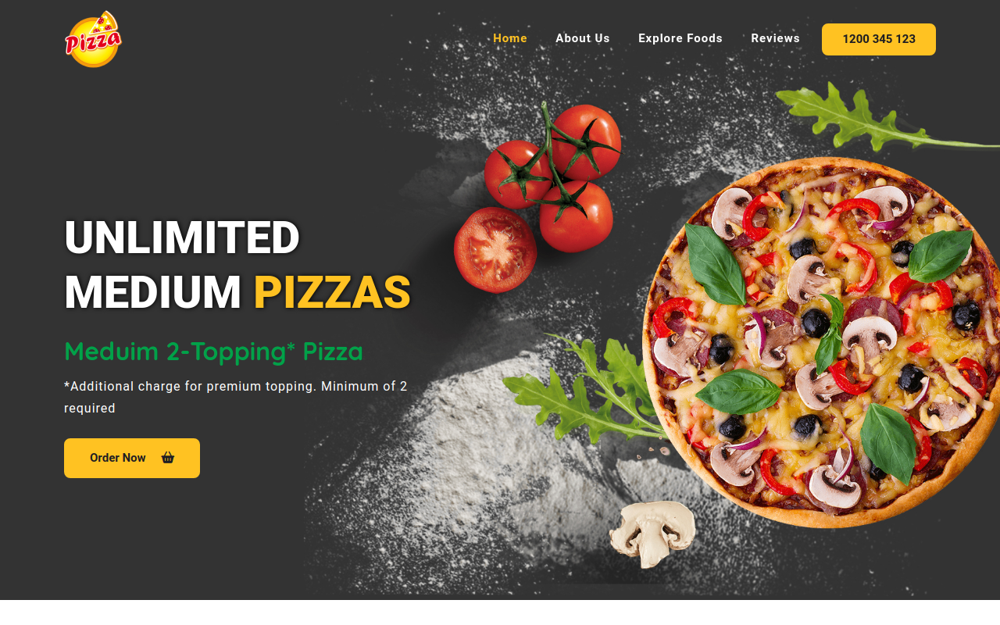

# Foodler - Restaurant Website

## Description

Foodler is a responsive restaurant website created to showcase various food items and provide information about the restaurant. The project was built using HTML, CSS, Bootstrap, and a touch of JavaScript to enhance user experience. Notable features include a section-based active link on the navigation menu, a customized scrollbar, and an auto-slider for testimonials.

### Table of Contents

- [Installation](#installation)
- [Usage](#usage)
- [Technologies Used](#technologies-used)
- [Features](#features)
- [Project Structure](#project-structure)
- [Credits](#credits)
- [License](#license)



## Installation

To run this project locally, follow these steps:

1. Clone the repository to your local machine.
    ```bash
    git clone https://github.com/m-ramzan786/Foodler.git
    ```

2. Open the project folder in your code editor.

3. Open the `index.html` file in your web browser.

## Usage

Explore the Foodler project:

1. Open the [live demo](https://foodler.vercel.app/) or run it locally.

2. Scroll through the single page to discover a delightful showcase of various food items, restaurant information, and customer testimonials.

## Technologies Used

- HTML
- CSS (Bootstrap included)
- JavaScript
- Font Awesome icons

## Features

- **Section-based Active Link:** Enhances user navigation by highlighting the active link based on the current section.
  
- **Customized Scrollbar:** Improves visual aesthetics with a unique design for the scrollbar.

- **Testimonial Auto-slider:** Engages visitors with an automated slider showcasing customer testimonials.

## Project Structure

The project is organized to provide information about the restaurant, display various food items, and feature customer testimonials. The responsive design ensures a seamless experience across different devices.

## Credits

I would like to acknowledge the following resources and tools that contributed to the success of this project:

- Bootstrap (https://getbootstrap.com/)

## License

This project is licensed under the [MIT License](LICENSE). Feel free to use and modify the code as per the license terms.

---

## Badges


## Feedback and Contributions

If you have any feedback or would like to contribute to the project, follow these steps:

1. Fork the project.
2. Create a new branch for your contribution: `git checkout -b feature-name`.
3. Commit your changes: `git commit -m 'Add new feature'`.
4. Push to the branch: `git push origin feature-name`.
5. Open a pull request.

## Contact

If you have any questions, suggestions, or just want to connect, feel free to reach out:

- Email: [mramzanstv@gmail.com](mramzanstv@gmail.com)
- Portfolio: [Muhammad-Ramzan-Portfolio](https://your-portfolio.com)
- LinkedIn: [in/m-ramzan786](https://www.linkedin.com/in/m-ramzan786/)

## Tests

The project includes a set of tests to ensure the functionality is working as expected. To run the tests, use the following command:
```bash
npm test
